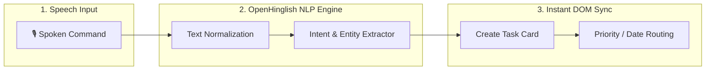
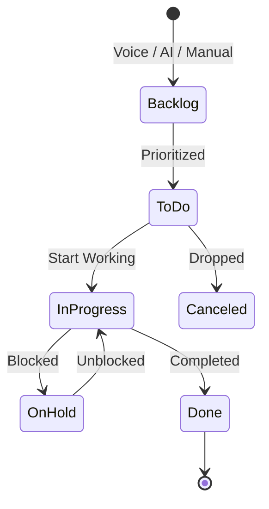
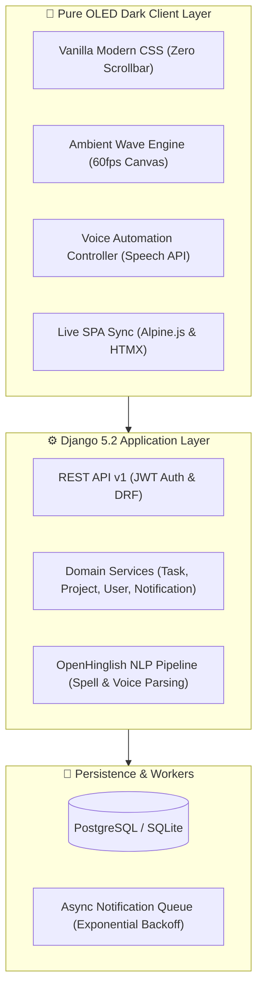

<div align="center">

```
  ████████╗ █████╗ ███████╗██╗  ██╗███████╗ █████╗ ██████╗ ███╗   ███╗███╗   ███╗
  ╚══██╔══╝██╔══██╗██╔════╝██║ ██╔╝██╔════╝██╔══██╗██╔══██╗████╗ ████║████╗ ████║
     ██║   ███████║███████╗█████═╝ █████╗  ███████║██████╔╝██╔████╔██║██╔████╔██║
     ██║   ██╔══██║╚════██║██╔═██╗ ██╔══╝  ██╔══██║██╔══██╗██║╚██╔╝██║██║╚██╔╝██║
     ██║   ██║  ██║███████║██║ ╚██╗██║     ██║  ██║██║  ██║██║ ╚═╝ ██║██║ ╚═╝ ██║
     ╚═╝   ╚═╝  ╚═╝╚══════╝╚═╝  ╚═╝╚═╝     ╚═╝  ╚═╝╚═╝  ╚═╝╚═╝     ╚═╝╚═╝     ╚═╝
```

### *Ultra-Fast • Pure OLED Black • Voice-Automated • Zero-Clutter*

[](https://www.python.org/)
[](https://www.djangoproject.com/)
[](#-voice-automated-task-management)
[](https://github.com/shankarmishra/openhinglish)
[](#)
[](LICENSE)
[](CONTRIBUTING.md)

---

[🎙️ Voice Automation](#-voice-automated-task-management) • [⚡ Feature Matrix](#-feature-matrix) • [🔄 Workflow Graph](#-kanban-workflow-lifecycle) • [🏛️ Architecture](#-system-architecture) • [🚀 Quick Start](#-quickstart-in-60-seconds) • [📡 API Reference](API.md)

</div>

---

## 🎙️ Voice-Automated Task Management

> [!IMPORTANT]
> **Hands-Free Speech-to-Task Orchestration**: Dictate tasks naturally in **English** or **Roman Hindi / Hinglish**. TaskFarmm automatically parses the title, extracts due dates, assigns priority tags, and places cards into your active board instantly!

### ⚡ Voice Pipeline Flow



### 🗣️ Example Voice Commands & Auto-Parsing

| Voice Dictation (Speech) | Normalized Transcript | Extracted Attributes | Resulting Action |
| :--- | :--- | :--- | :--- |
| 💬 *"Review security headers by tomorrow 5 PM with high priority"* | `Review security headers` | 🔴 **High** • 📅 Tomorrow 5 PM | ✨ Task created in **To Do** |
| 💬 *"Kal tak payment gateway bug fix krna hai urgent"* | `Payment gateway bug fix karna hai` | 🔴 **High** • 📅 Tomorrow | ✨ Task created in **To Do** |
| 💬 *"Move design tokens task to completed column"* | `Move design tokens to done` | 🏷️ `Design System` • ✅ Done | ⚡ Card moved to **Done** |

---

## ⚡ Feature Matrix

| Feature | Description | Status |
| :--- | :--- | :---: |
| 🎙️ **Voice Automation** | Hands-free natural speech task creation with multi-lingual NLP parsing | `⚡ LIVE` |
| 📋 **6-Column Kanban** | Drag-and-drop board with Smart (4-col) & Super (6-col) templates | `⚡ LIVE` |
| 🗂️ **Trello-Style Modal** | Full-width header, file attachments, and **Ctrl+V clipboard paste** | `⚡ LIVE` |
| 🌐 **OpenHinglish NLP** | Real-time typo correction (`krna` ➔ `karna`, `tmrw` ➔ `tomorrow`) | `⚡ LIVE` |
| 👥 **Team RBAC (99 Users)** | Owner, Admin, Member, Viewer roles with granular workspace access | `⚡ LIVE` |
| 📬 **Notification Queue** | Background async queue with exponential backoff & OLED email templates | `⚡ LIVE` |
| 🔑 **Google OAuth 2.0** | RFC 6749 single sign-on with automatic workspace provisioning | `⚡ LIVE` |
| 🌊 **Ambient Wave Canvas** | GPU-accelerated 60fps HTML5 canvas responding to mouse ripple | `⚡ LIVE` |

<details>
<summary><b>🔍 Expand: Deep Dive on Core Capabilities</b></summary>
<br>

### 1. 🗂️ Rich Trello Task Modal
- **Direct Clipboard Paste (`Ctrl + V`)**: Instantly paste screenshots directly into task descriptions or comments.
- **Dynamic Checklists**: Subtasks with auto-calculating `0-100%` progress indicator bar.
- **Attachments Engine**: Drag-and-drop document upload with inline thumbnail previews and direct downloads.

### 2. 🔤 OpenHinglish Spell Engine
- Normalizes shorthand (`msg` ➔ `message`, `intv` ➔ `interview`, `tmrw` ➔ `tomorrow`).
- Autocorrects transliterated Roman Hindi (`krna` ➔ `karna`, `hoga` ➔ `hoga`, `proejct` ➔ `project`).
- Interactive live tester in Settings.

### 3. 👥 Sub-User Account Management
- Create up to **99 team member accounts** under a single owner.
- Role-based permissions preventing unauthorized task deletion or board mutation.

</details>

---

## 🔄 Kanban Workflow Lifecycle



---

## 🏛️ System Architecture



<details>
<summary><b>📂 Expand: Complete Repository Directory Tree</b></summary>
<br>

```
TaskFarmm/
├── config/              # Django core settings, WSGI, ASGI, URLs
├── todo/                # Core domain application
│   ├── api/             # REST API v1 ViewSets & Routers
│   ├── autocorrect.py   # OpenHinglish NLP engine
│   ├── models.py        # Task, Category, Attachment, Comment, UserProfile
│   ├── services.py      # Business logic service layer
│   ├── views.py         # Dashboard, Kanban, Projects, Voice & AI controllers
│   └── tests/           # 89 Unit, integration & API test cases
├── templates/todo/      # HTML5 templates (Dashboard, Kanban, Modals, AI)
├── static/todo/         # Pure CSS design system & JavaScript engines
├── API.md               # Complete REST API reference
├── SETUP.md             # Production setup & deployment documentation
└── CONTRIBUTING.md      # Guidelines for open-source contributors
```

</details>

---

## 🚀 Quickstart in 60 Seconds

```bash
# 1. Clone & enter repository
git clone https://github.com/logicbyroshan/taskfarmm-tasks-management.git && cd taskfarmm-tasks-management

# 2. Setup virtual environment & dependencies
python -m venv venv && source venv/bin/activate  # Windows: .\venv\Scripts\activate
pip install -r requirements.txt

# 3. Setup environment & migrate
cp .env.example .env && python manage.py migrate && python manage.py collectstatic --noinput

# 4. Launch dev server
python manage.py runserver
```

🌐 Open **[http://127.0.0.1:8000](http://127.0.0.1:8000)** in your browser.

<details>
<summary><b>🚢 Expand: Cloud Deployment Options (1-Click)</b></summary>
<br>

| Platform | Type | Quick Setup |
| :--- | :--- | :--- |
| **Render** | Web Service | Auto-detected via `Procfile` & `requirements.txt` ([Guide](SETUP.md#deploying-to-render)) |
| **Railway** | Web Service | Native PostgreSQL attachment & Gunicorn ([Guide](SETUP.md#deploying-to-railway)) |
| **Ubuntu VPS** | Nginx + Gunicorn | Production Systemd service + SSL Certbot ([Guide](SETUP.md#-3-production-vps-deployment)) |

</details>

---

## 🧪 Testing & Quality Benchmark

```bash
python manage.py test
```

```
Ran 89 tests in 116.9s ... OK
System check identified no issues (0 silenced).
```

---

## 📡 REST API Quick Glance

| Method | Endpoint | Description | Auth |
| :--- | :--- | :--- | :---: |
| `POST` | `/api/v1/auth/token/` | Obtain JWT token pair | ❌ |
| `GET` | `/api/v1/tasks/` | List & filter tasks (search, status, priority) | ✅ |
| `POST` | `/api/v1/tasks/` | Create task with checklist & tags | ✅ |
| `POST` | `/api/v1/voice/parse/` | Parse voice speech into task payload | ✅ |
| `GET` | `/api/v1/categories/` | List project workspaces & metrics | ✅ |
| `GET` | `/api/v1/notifications/` | In-app notification hub & unread count | ✅ |

*For complete payload examples and schemas, read [`API.md`](API.md).*

---

## 🤝 Contributing & Community

Contributions are what make open source amazing!

1. 🍴 **Fork** the repository
2. 🌿 **Branch**: `git checkout -b feature/awesome-feature`
3. 💾 **Commit**: `git commit -m "feat: add awesome feature"`
4. 🚀 **Push & PR**: `git push origin feature/awesome-feature`

Read [`CONTRIBUTING.md`](CONTRIBUTING.md) and [`CODE_OF_CONDUCT.md`](CODE_OF_CONDUCT.md) for full guidelines.

---

## 📄 License

This project is licensed under the **MIT License** — see [`LICENSE`](LICENSE) for details.

<div align="center">
  <sub>Built with ⚡ by <b><a href="https://github.com/logicbyroshan">Roshan Damor (LogicByRoshan)</a></b> and community contributors.</sub>
</div>
