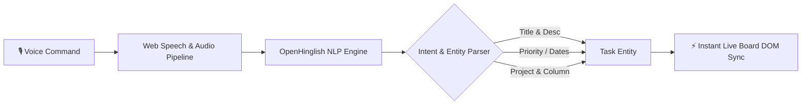
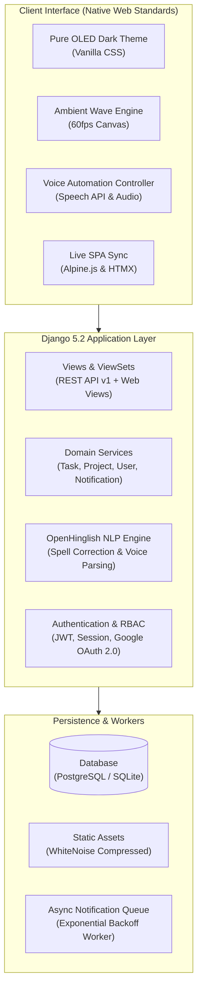

<div align="center">

# ⚡ TaskFarmm

### *Next-Generation Intelligent Task & Project Orchestration Platform*

[](https://www.python.org/)
[](https://www.djangoproject.com/)
[](#-new-feature-spotlight-voice-automated-task-management)
[](https://github.com/shankarmishra/openhinglish)
[](#)
[](LICENSE)
[](CONTRIBUTING.md)

<br>

<p align="center">
  <b>TaskFarmm</b> is a lightning-fast, visually stunning, OLED pure-black task and project orchestration system built with <b>Django 5</b>, <b>Voice AI Automation</b>, <b>OpenHinglish NLP</b>, <b>Alpine.js / HTMX</b>, and <b>HTML5 Canvas</b>. Engineered for seamless productivity, real-time client-side sync, and zero interface bloat.
</p>

[🎙️ Voice Automation](#-new-feature-spotlight-voice-automated-task-management) • [✨ Key Features](#-key-features) • [🏛️ Architecture](#-system-architecture) • [🚀 Quick Start](#-quick-start) • [📡 API Reference](API.md) • [🚢 Deployment](SETUP.md) • [🤝 Contributing](CONTRIBUTING.md)

</div>

---

## 🎙️ NEW FEATURE SPOTLIGHT: Voice-Automated Task Management

> [!IMPORTANT]
> **TaskFarmm introduces Voice-Automated Task Management** — transform natural speech into structured tasks, automatic priority ratings, due dates, and board assignments in real time!



### 🌟 Voice Automation Highlights

| Capability | How It Works | Example Voice Command |
| :--- | :--- | :--- |
| **🗣️ Natural Voice-to-Task** | Dictate new tasks naturally without touching the keyboard. | *"Create a task: Review API security headers by tomorrow 5 PM with high priority"* |
| **🌐 Bilingual NLP Engine** | Seamlessly parses English and Roman Hindi / Hinglish colloquial phrases. | *"Kal tak payment gateway ka bug fix krna hai high priority me"* |
| **⚡ Intelligent Entity Parsing** | Extracts dates, times, priority levels, and category assignments automatically. | Extracts: `title`, `priority='high'`, `due_date='tomorrow'`, `category='Backend'` |
| **📋 Hands-Free Kanban Actions** | Move cards across columns, toggle completion, or trigger filters via speech. | *"Move Figma tokens task to Done column"* |

---

## ✨ Key Features Matrix

### 1. 📋 Agile Kanban & Project Workspaces
<table>
  <tr>
    <td width="50%">
      <h4>⚡ Smart & Super Workflow Templates</h4>
      <ul>
        <li><b>Smart Board</b>: 4 essential stages (<i>To Do, In Progress, On Hold, Done</i>).</li>
        <li><b>Super Board</b>: 6 advanced stages (<i>Backlog, To Do, In Progress, On Hold, Done, Canceled</i>).</li>
        <li>Custom project color accents and board templates.</li>
      </ul>
    </td>
    <td width="50%">
      <h4>🖱️ Live Drag-and-Drop & Instant SPA</h4>
      <ul>
        <li>Smooth HTML5 drag-and-drop card orchestration.</li>
        <li>Zero page reload updates across columns with instant counter updates.</li>
        <li>Click-to-edit project headers and column names.</li>
      </ul>
    </td>
  </tr>
</table>

### 2. 🗂️ Advanced Trello-Style Task Modal
<table>
  <tr>
    <td width="50%">
      <h4>📎 Attachments & Clipboard Pasting</h4>
      <ul>
        <li>Upload PDFs, spreadsheets, Word docs, and images with inline previews.</li>
        <li><b>Direct <code>Ctrl + V</code> paste</b> screenshots directly from clipboard into tasks and comments.</li>
      </ul>
    </td>
    <td width="50%">
      <h4>✅ Dynamic Checklists & Activity Feed</h4>
      <ul>
        <li>Interactive subtask checklists with auto-calculated progress percentage bars.</li>
        <li>Real-time comment feed with author avatars, edit, and delete support.</li>
      </ul>
    </td>
  </tr>
</table>

### 3. 🌐 OpenHinglish Spell-Check & AI Assistant
<table>
  <tr>
    <td width="50%">
      <h4>🔤 OpenHinglish Text Normalization</h4>
      <ul>
        <li>Normalizes shorthand (<code>tmrw</code> ➔ <code>tomorrow</code>, <code>msg</code> ➔ <code>message</code>, <code>intv</code> ➔ <code>interview</code>).</li>
        <li>Autocorrects typos (<code>krna</code> ➔ <code>karna</code>, <code>proejct</code> ➔ <code>project</code>).</li>
        <li>Interactive live tester in Settings with instant toggle.</li>
      </ul>
    </td>
    <td width="50%">
      <h4>🤖 ChatGPT-Style AI Workspace</h4>
      <ul>
        <li>Dedicated AI Assistant side drawer and workspace.</li>
        <li>Generates full project task breakdowns with 1-click creation into your active board.</li>
      </ul>
    </td>
  </tr>
</table>

### 4. 👥 Enterprise Security, Multi-User Teams & Notifications
<table>
  <tr>
    <td width="50%">
      <h4>🔐 Multi-User Roles & Google SSO</h4>
      <ul>
        <li><b>Role-Based Access Control (RBAC)</b>: Account Owner, Admin, Member, Viewer roles.</li>
        <li>Support for up to 99 sub-users per workspace.</li>
        <li>RFC 6749 compliant Google OAuth 2.0 single sign-on.</li>
      </ul>
    </td>
    <td width="50%">
      <h4>📬 Reliable Notification Delivery Queue</h4>
      <ul>
        <li>Asynchronous notification queue with exponential backoff retries (<code>30s</code>, <code>2m</code>, <code>8m</code>, <code>30m</code>).</li>
        <li>Topbar notification bell hub with real-time unread counter.</li>
        <li>6 responsive pitch-black OLED email templates.</li>
      </ul>
    </td>
  </tr>
</table>

---

## 🎨 Pure OLED Black Design System

TaskFarmm is built with an unapologetic **Pitch-Black OLED (`#000000`)** philosophy:

```
┌─────────────────────────────────────────────────────────────┐
│  🌌 Ambient Wave Canvas (Interactive 60fps HTML5 Canvas)     │
│  ┌───────────────────────────────────────────────────────┐  │
│  │  🖤 Pure Black Canvas Surface (#000000)                │  │
│  │  ┌──────────────────┐  ┌───────────────────────────┐  │  │
│  │  │  Sidebar (Pills) │  │  Kanban Board (Zero Gaps) │  │  │
│  │  │  • Projects      │  │  [Backlog] [To Do] [Done] │  │  │
│  │  │  • Voice Input   │  │  ┌───────┐ ┌────┐ ┌─────┐ │  │  │
│  │  │  • AI Assistant  │  │  │ Card  │ │Card│ │Card │ │  │  │
│  │  └──────────────────┘  └───────────────────────────┘  │  │
│  └───────────────────────────────────────────────────────┘  │
└─────────────────────────────────────────────────────────────┘
```

- **Zero Vertical Page Scrollbars**: Ultra-clean viewport-contained experience with smooth micro-animations.
- **Dynamic Wave Canvas**: GPU-accelerated cool-gradient wave crests (Teal, Sapphire, Violet) responding to mouse ripple.
- **Curated High-Contrast Accents**: Tailored HSL status pills, sleek borders (`#27272a`), and zero muddy gray backgrounds.

---

## 🏛️ System Architecture



---

## 🚀 Quick Start

### 📋 Prerequisites
- **Python**: 3.11 or higher
- **Git**: 2.30+
- **Pip**: Latest version

### ⚙️ Step-by-Step Installation

```bash
# 1. Clone the repository
git clone https://github.com/logicbyroshan/taskfarmm-tasks-management.git
cd taskfarmm-tasks-management

# 2. Create and activate a virtual environment
# On Linux / macOS:
python3 -m venv venv
source venv/bin/activate
# On Windows (PowerShell):
python -m venv venv
.\venv\Scripts\Activate.ps1

# 3. Install dependencies
pip install -r requirements.txt

# 4. Initialize environment variables
cp .env.example .env

# 5. Run database migrations & collect static files
python manage.py migrate
python manage.py collectstatic --noinput

# 6. Verify with automated test suite
python manage.py test

# 7. Start the development server
python manage.py runserver
```

Open [http://127.0.0.1:8000](http://127.0.0.1:8000) in your browser.

---

## 📡 REST API v1 Quick Reference

TaskFarmm exposes a full RESTful API with JWT authentication. See [`API.md`](API.md) for full documentation.

| Method | Endpoint | Description | Auth Required |
| :--- | :--- | :--- | :---: |
| `POST` | `/api/v1/auth/token/` | Obtain JWT token pair (access & refresh) | ❌ |
| `POST` | `/api/v1/auth/token/refresh/` | Refresh expired access token | ❌ |
| `GET` | `/api/v1/tasks/` | List & filter tasks (search, status, priority, project) | ✅ |
| `POST` | `/api/v1/tasks/` | Create a new task with checklist & tags | ✅ |
| `GET` | `/api/v1/tasks/{id}/` | Retrieve task details, attachments & comments | ✅ |
| `PATCH` | `/api/v1/tasks/{id}/` | Update task status, priority, or column position | ✅ |
| `POST` | `/api/v1/voice/parse/` | Parse natural voice input into structured task payload | ✅ |
| `GET` | `/api/v1/categories/` | List user's project workspaces & metrics | ✅ |
| `GET` | `/api/v1/notifications/` | List user notifications & unread counter | ✅ |

---

## 🚢 Production Deployment

TaskFarmm is production-ready for single-click cloud deploys and VPS configurations. Full deployment instructions are in [`SETUP.md`](SETUP.md).

### ☁️ Cloud Platforms

| Platform | Configuration | Guide |
| :--- | :--- | :--- |
| **Render** | Automatic detection via `requirements.txt` & `Procfile` | [Render Guide](SETUP.md#deploying-to-render) |
| **Railway** | Native PostgreSQL attachment & Gunicorn runner | [Railway Guide](SETUP.md#deploying-to-railway) |
| **Ubuntu VPS** | Nginx + Gunicorn + Systemd + SSL Certbot | [VPS Guide](SETUP.md#-3-production-vps-deployment) |

---

## 🧪 Testing & Quality Assurance

TaskFarmm features an exhaustive automated test suite covering models, services, views, REST API endpoints, OpenHinglish text normalization, and role permissions.

```bash
# Run all 89 test cases
python manage.py test
```

```
Ran 89 tests in 116.9s ... OK
System check identified no issues (0 silenced).
```

---

## 📁 Project Structure

```
TaskFarmm/
├── config/              # Django core settings, WSGI, ASGI, URLs
├── todo/                # Core domain application
│   ├── api/             # REST API v1 ViewSets & Routers
│   ├── autocorrect.py   # OpenHinglish NLP engine
│   ├── models.py        # Task, Category, Attachment, Comment, UserProfile
│   ├── services.py      # Business logic service layer
│   ├── views.py         # Dashboard, Kanban, Projects, Voice & AI controllers
│   └── tests/           # 89 Unit, integration & API test cases
├── templates/todo/      # HTML5 templates (Dashboard, Kanban, Modals, AI)
├── static/todo/         # Pure CSS design system & JavaScript engines
├── API.md               # Complete REST API reference
├── SETUP.md             # Production setup & deployment documentation
└── CONTRIBUTING.md      # Guidelines for open-source contributors
```

---

## 🤝 Contributing

We welcome contributions from developers worldwide! Whether fixing bugs, improving docs, or proposing new features:

1. **Fork** the repository.
2. **Create a branch**: `git checkout -b feature/amazing-feature`.
3. **Commit changes**: `git commit -m "feat: add voice command shortcut"`.
4. **Push to branch**: `git push origin feature/amazing-feature`.
5. **Open a Pull Request**.

See [`CONTRIBUTING.md`](CONTRIBUTING.md) and our [`CODE_OF_CONDUCT.md`](CODE_OF_CONDUCT.md) for full details.

---

## 📄 License

This project is licensed under the **MIT License** — see the [LICENSE](LICENSE) file for details.

---

<div align="center">
  <sub>Engineered with ⚡ by <b><a href="https://github.com/logicbyroshan">Roshan Damor (LogicByRoshan)</a></b> and open-source contributors.</sub>
</div>
